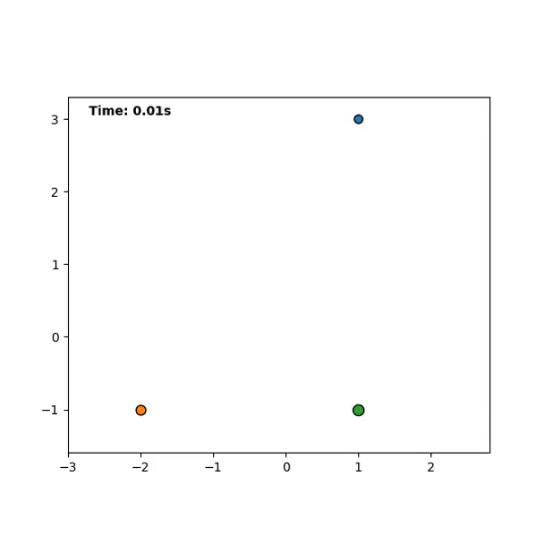

### Theoretical Physics MSci @ University of Nottingham Undergraduate

---

## **N-body Graviational Dynamics Solver** - 3rd Year University Scientific Computing Project

**Overview:** High 

**Key details:** Python (Numpy, SciPy), Matplotlib, Chaos Theory

[View Project](projects/N-body-solver.md)

